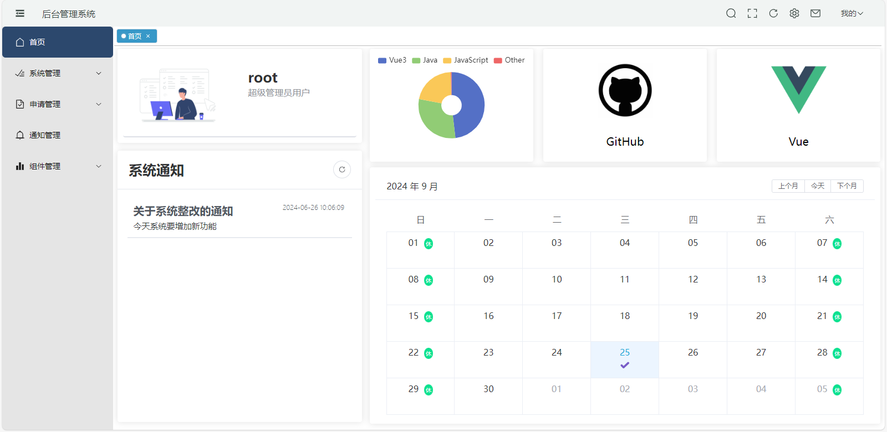

# 权限管理系统

## 一、系统简介

​	该系统是一个使用vue3+element-plus打造的后台管理系统，系统的权限设计理念基于RBAC模型，支持用户、角色、权限之间的多对多关联。该系统具备如下特性

- **技术：**使用vue3+vite5等前端技术开发
- **主题：**用户可个性化配置主题
- **配置：**用户可个性化部分系统设置
- **国际化：**系统部分功能支持国际化
- **权限：**系统实现完整的权限配置
- **组件：**系统内置了若干二次封装及自定义组件

## 二、技术栈

| 框架         | 说明           | 版本    |
| ------------ | -------------- | ------- |
| Vue          | Vue框架        | 3.4.21  |
| SpringBoot   | 后端开发框架   | 3.3.0   |
| Node         | 运行环境       | 16.20.2 |
| npm          | 包管理工具     | 8.19.4  |
| Vite         | 开发与构建工具 | 5.2.8   |
| Mybatis-plus | 数据库操作工具 | 3.5.5   |
| MySQL        | 数据库         | 8.0.13  |

# 三、系统功能

| 功能     | 描述                                                         |
| -------- | ------------------------------------------------------------ |
| 账号申请 | 新用户可以通过账号申请来申请账号                             |
| 用户管理 | 用户是系统的基本操作者，该功能主要完成用户的基本配置，如角色分配等 |
| 角色管理 | 角色是系统的核心，该功能主要完成角色的基本配置，包括分配权限及路由等 |
| 权限管理 | 权限是系统的基本配置项，该功能主要完成权限的创建等操作       |
| 申请审核 | 该功能主要用于处理新用户的账号申请                           |
| 站内信   | 系统内的用户之间的消息通知等                                 |
| 操作日志 | 用户对该系统各项操作的日志信息管理                           |
| 通知管理 | 系统中面向全体用户的通知                                     |
| 文件管理 | 支持大文件分片上传与下载，多文件上传等功能                   |

